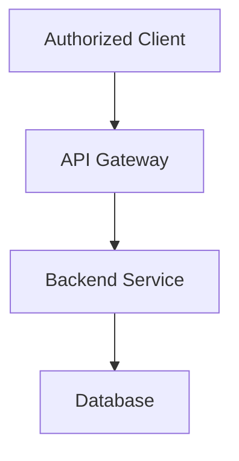
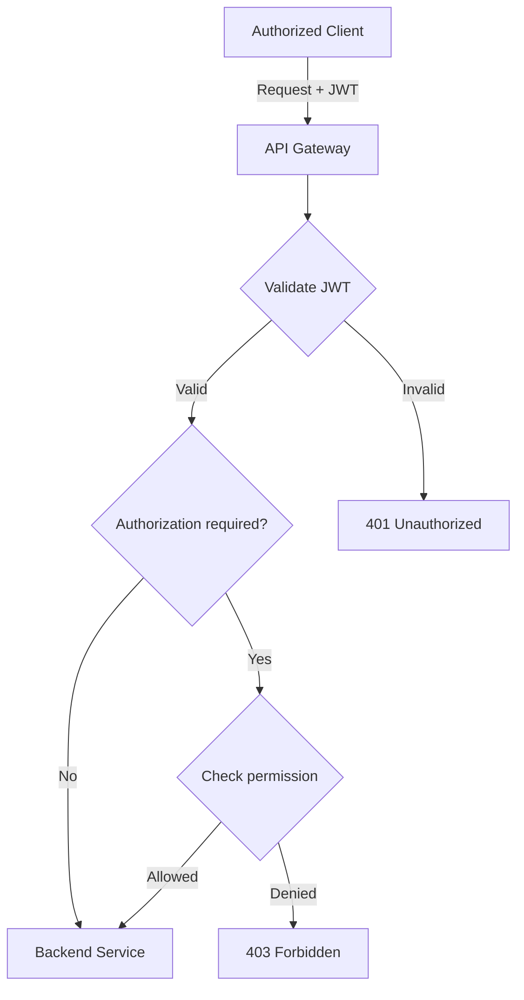

# API Gateway
🚧 ***This service is currently under development.** Its architecture, APIs, features, and implementation details may change as development progresses.*

The API Gateway is the entry point for clients communicating with the chat application's backend services.

It is responsible for handling incoming HTTP connections, authenticating users, routing requests to the appropriate microservices, and providing a unified API for the frontend. While the application uses [Socket.io](https://github.com/socketio/socket.IO) to handle realtime data exchanges (especially for realtime chats), the [Socket.io](https://github.com/socketio/socket.IO) is handled on the chats service to prevent bottleneck on the API Gateway, especially during high traffic.

## Responsibilities
The API Gateway handles:

- HTTP request routing
- JWT authentication
- Request authentication and authorization
- Communication with backend microservices
- Error handling and response normalization
- Request validation where appropriate

The gateway should not contain business logic that belongs to individual services.

For example, the gateway may authenticate a request and forward a `get_rooms` operation to the `chats_service`, but the `chats_service` is responsible for deciding how the room would be fetched to the gateway, and thus to the client/frontend. As a result, all the modules in gateway does not contain `service.ts` files that typically store database level logic, or the database configurations. 

## Services 
The gateway communicates with the following services:
- **User Services** - Authentication, user profiles and user-related operations
- **Chats Service** - Rooms, participants, messages and chat operations
- **Media Service** - File/image uploads and media management

While the API Gateway exposes HTTP endpoints to the authorized clients, the gateway and other services communicate with each other using the `TCP (Transmission Control Protocol)`, a built-in transfer layer option for [NestJS](https://github.com/nestjs/nest) microservices. Currently, however, there is one exception to this: API Gateway uses HTTP instead of TCP to communicate with Service Media

## HTTP API
The gateway exposes following HTTP endpoints to clients:

### Users
- **POST** `/users/login` [logging in]
- **POST** `/users/` [user registration]<br/>
  Can also send request to the POST endpoint `/user-images/:id` in the Service Media to store user images (profile, header, or both) if the user also include the image. 
- **GET** `/users/profile` [get profile]<br/>
  An endpoint to fetch user data using an ID from the JWT.
- **GET** `/users` [get users]
- **GET** `/users/:id` [get users with ID]<br/>
  An endpoint to fetch user data using an ID from the param.
- **PATCH** `/users/` [update user]<br/>
  Can also send request to the PATCH endpoint `/user-images/:id` in the Service Media to store new user images (profile, header, or both) if the user also include the image.
- **DELETE** `/users/:id` [delete user by id] `ADMIN ONLY`<br/>
  An endpoint for the admin to delete an individual user.
- **DELETE** `/users/` [self delete user]<br/>
  An endpoint for a user to delete themselves.

### Chats 
- **POST** `/chats/rooms/participants/:id` [add group participant]
- **POST** `/chats/groups/` [create groups]
- **GET** `/chats/rooms/user` [get rooms by user id]<br/>
  Fetch the data of rooms where the user is a participant.
- **PATCH** `/groups/self/participants/:id` [self update room participant]<br/>
  An endpoint for group participants to update their own roles in the group.
- **PATCH** `/groups/participants/:id` [update room participant]<br/>
  An endpoint for group admins to update other participants role in the group.
- **PATCH** `/groups/` [update room] `GROUP ADMIN ONLY`
- **DELETE** `/groups/self/participant/:id` [self delete group participant]<br/>
  An endpoint for group participants to delete themselves from the group.
- **DELETE** `/groups/participants/:id` [delete group participant] `GROUP ADMIN ONLY` <br/>
- **DELETE** `/groups/:id` [delete group] `GROUP ADMIN ONLY`

The gateway forwards requests to the appropriate internal service. For example:

  
## Authentication and Authorization
Most endpoints require a valid authentication token, using a JWT token like: `Bearer <token>`. The token contains at least two data: `id` and `role`. The `role` data is required for several endpoints that are authorized for system admins only.  

Example:


For browser-based authentication, an `HttpOnly` cookie may be used instead (although this is yet to be implemented).

Authentication should be centralized at the gateway where possible, while services should still enforce authorization rules for operations they own.

## Environment Variables 
Each services contain the environment variables in a file named `.env`. It's neccesary to include the `.env` into the `.gitignore` file, especially when the repository is public to prevent any sensitive information or data from getting exposed.

The API Gateway `.env` file contain the following variables:
```
PORT=
PROJECT_URL=

USERS_SERVICE_HOST=
USERS_SERVICE_PORT=

MEDIA_SERVICE_HOST=
MEDIA_SERVICE_PORT=

MEDIA_SERVICE_HTTP_PORT=
MEDIA_SERVICE_HTTP_URL=

CHATS_SERVICE_HOST=
CHATS_SERVICE_PORT=

TOKEN_SECRET_KEY=
TOKEN_EXPIRES=

ENVIRONMENT=

REDIS_HOST=
REDIS_PORT=

# This was inserted by `prisma init`:
# Environment variables declared in this file are NOT automatically loaded by Prisma.
# Please add `import "dotenv/config";` to your `prisma.config.ts` file, or use the Prisma CLI with Bun
# to load environment variables from .env files: https://pris.ly/prisma-config-env-vars.

# Prisma supports the native connection string format for PostgreSQL, MySQL, SQLite, SQL Server, MongoDB and CockroachDB.
# See the documentation for all the connection string options: https://pris.ly/d/connection-strings

# The following `prisma+postgres` URL is similar to the URL produced by running a local Prisma Postgres 
# server with the `prisma dev` CLI command, when not choosing any non-default ports or settings. The API key, unlike the 
# one found in a remote Prisma Postgres URL, does not contain any sensitive information.

# DATABASE_URL=
DATABASE_URL=
```
